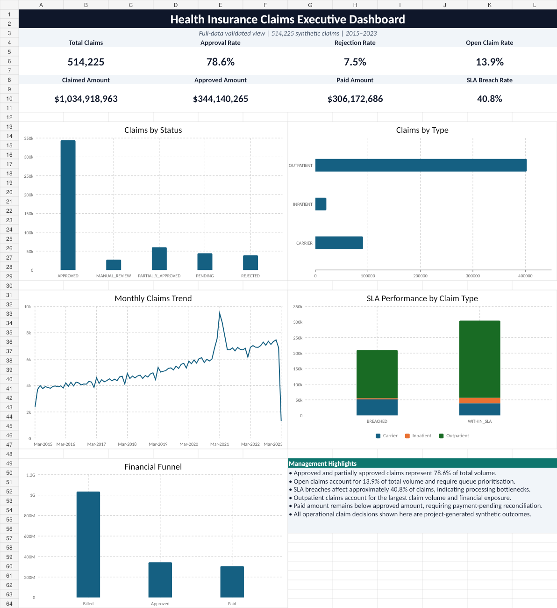

# Health Insurance Claims Intelligence

A reproducible data engineering project built with PySpark, Delta Lake and SQL Server using CMS synthetic Medicare claims. It converts claim lines into validated claim-level tables, with Parquet exports for SQL and Power BI reporting.

[](https://github.com/Subhamnayak18/health-insurance-claims-intelligence/actions/workflows/tests.yml)

The existing pandas pipeline, SQL star schema and Excel dashboard are retained. Lakehouse measures come from the source claims. Approval decisions, fraud flags, risk scores and leakage estimates in the original operational model are simulated.

## Verified results

| Source | Claim lines | Unique claims | Claim payment |
| --- | ---: | ---: | ---: |
| Carrier | 1,121,004 | 90,705 | 127,158,142.15 |
| Inpatient | 58,066 | 20,867 | 141,046,614.08 |
| Outpatient | 575,092 | 402,653 | 730,871,561.85 |
| **Total** | **1,754,162** | **514,225** | **999,076,318.08** |

Every claim key, line count and claim payment reconciled with the original claim-header dataset. The five Gold tables were exported and loaded into local SQL Server; counts and payment totals matched. All **12 automated tests passed locally**, including snapshot correction, replay, schema evolution, quarantine and recovery.

| Gold table | Grain | Verified rows |
| --- | --- | ---: |
| `fact_claim` | Claim type + claim ID | 514,225 |
| `dim_date` | Calendar day | 2,928 |
| `dim_provider` | Typed provider identifier | 13,136 |
| `monthly_claims` | Claim month + claim type | 292 |
| `provider_claims` | Representative provider + claim type | 14,810 |

Claims span February 25, 2015 through March 2, 2023. The original beneficiary-history output contains 86,917 beneficiary-year rows across 2015–2025. These are synthetic source totals, not real patient outcomes, savings or fraud-model results. See the [verification record](docs/verification.md) and [machine-readable evidence](data/metadata/lakehouse_verification.json).

## Architecture

```text
CMS pipe-delimited CSV
  -> Bronze Delta: source strings and file lineage
  -> Silver Delta: cleaned, typed, validated claim lines
       -> Quarantine: invalid rows and conflicting keys/headers
  -> Gold Delta: claim fact, provider/date dimensions, reporting summaries
  -> Current-snapshot Parquet exports
  -> SQL Server lake schema
  -> Power BI integration (documented)
```

- IDs remain strings and money uses decimal types.
- Exact duplicate lines are removed. Conflicting line keys and inconsistent claim headers fail validation.
- Missing keys, invalid required dates and invalid amounts are written to quarantine tables.
- Negative payments are retained and flagged as possible adjustments.
- Claim payment is counted once per claim, avoiding repeated line-header totals.
- SHA-256 fingerprints skip unchanged files. Changed snapshots use Delta MERGE in Silver, including removal of absent lines.
- Additive source columns are retained; removed columns or incompatible Silver types fail explicitly.
- A writer lock prevents concurrent pipeline runs; incomplete runs block exports until recovery succeeds.

Inputs must be **complete snapshots**. Incremental processing happens at the file level because the CMS files do not provide reliable change-event timestamps. Gold aggregates rebuild after changed inputs. Run one writer at a time and export or refresh consumers only after the pipeline succeeds. Use `--force` after changing transformation code. See [architecture and recovery](docs/architecture.md).

## Setup

Use **Python 3.11 and Java 17**. PySpark 3.5.6 and Delta 3.3.2 are pinned in `requirements.txt`. Initial installation needs network access for Python dependencies and Delta JVM jars from Maven.

On Windows, configure `JAVA_HOME`, `HADOOP_HOME` and their `bin` directories in `PATH` before running Spark. Hadoop requires `winutils.exe` and `hadoop.dll`. The [local setup guide](docs/local_setup.md) includes the verified Windows runtime commands. Linux does not need these Windows helpers. SQL loading additionally requires a running SQL Server and Microsoft ODBC Driver 18.

```powershell
git clone https://github.com/Subhamnayak18/health-insurance-claims-intelligence.git
cd health-insurance-claims-intelligence
py -3.11 -m venv .venv-spark311
.\.venv-spark311\Scripts\Activate.ps1
python -m pip install -r requirements.txt
python -m pip check
python -m pytest -q
```

For the existing checkout, skip cloning and reuse the working environment. On Linux, use `python3.11 -m venv .venv-spark311` and `source .venv-spark311/bin/activate`; the Python module commands below are the same.

### Try the included fixtures

This small run requires no CMS download. The hand-written fixture contains four lines and three claims, including a negative adjustment.

```powershell
python -m src.pipeline --raw-dir tests/fixtures --data-dir .runtime/demo-lake
python -m src.pipeline --raw-dir tests/fixtures --data-dir .runtime/demo-lake
python -m src.export_gold --data-dir .runtime/demo-lake --output-dir .runtime/demo-export
```

The second run checks unchanged-input replay. Fixture results are separate from the full-data counts above.

### Run the full CMS snapshots

Download the claims from the [CMS Synthetic Medicare collection](https://data.cms.gov/collection/synthetic-medicare-enrollment-fee-for-service-claims-and-prescription-drug-event). Extract `carrier.csv`, `inpatient.csv` and `outpatient.csv` into `data/raw/cms_synthetic_claims/extracted/`. Files are pipe-delimited despite their `.csv` extension.

```powershell
$env:PYSPARK_SUBMIT_ARGS = '--driver-memory 3g pyspark-shell'
python -m src.pipeline
python -m src.export_gold
```

On Linux, set the driver option with `export PYSPARK_SUBMIT_ARGS='--driver-memory 3g pyspark-shell'`. Lakehouse outputs are under `data/lakehouse/{bronze,silver,gold,quarantine,state}` and exported Parquet tables are under `data/exports/gold/`. Raw data, generated tables, virtual environments and native runtime binaries are excluded from Git.

## SQL and reporting

For local SQL Server, create the existing database with `sql/schema/01_create_database_and_schemas.sql`. Run `sql/schema/05_create_lakehouse_tables.sql` in `HealthInsuranceClaimsDW`, then load the exported Gold tables:

```powershell
python -m src.load_gold_to_sql
```

The loader replaces only `lake.*` tables in one transaction, validates counts and reconciles claim payments. It defaults to local Windows authentication. Set `CLAIMS_SQL_CONNECTION_STRING` for another SQL Server or Azure SQL connection; keep credentials outside source control. Reporting queries are in `sql/analysis/03_lakehouse_analysis.sql`.

The [SQL and Azure guide](docs/sql_and_azure.md) covers execution order and the retained operational warehouse. The [Power BI guide](powerbi/README.md) documents relationships and measures for Gold. Azure/Databricks deployment and a Power BI Desktop refresh have **not** been executed. The existing local PBIX is preserved and excluded from Git.

The original Excel dashboard is included in [the workbook](excel/Health_Insurance_Claims_Analysis.xlsx):



## Repository

```text
.github/workflows/       Spark/Delta fixture tests on push and pull request
src/ingestion/           CSV ingestion and file fingerprints
src/transformations/     Spark transformations and retained pandas scripts
src/quality/             Claims data-quality rules
src/utils/               Spark, Delta and SQL helpers
src/data_cleaning/       Original pandas cleaning
src/data_generation/     Seeded operational simulation
src/validation/          Original profiling and validation
src/pipeline.py          Bronze/Silver/Gold pipeline
src/export_gold.py       Current-snapshot Parquet exports
src/load_gold_to_sql.py  Transactional SQL publication
sql/                    Schemas, loads, checks and analytics
tests/                  Hand-written fixtures and 12 automated tests
docs/                   Architecture, runbooks and original analysis notes
data/metadata/          Source register, audits and verification evidence
excel/                  Existing workbook and screenshot
powerbi/                Report integration notes
```

The [local setup guide](docs/local_setup.md#original-pandas-workflow) also documents the original pandas workflow. Planning notes in `docs/01_foundation` are historical and do not describe deployed cloud components.
